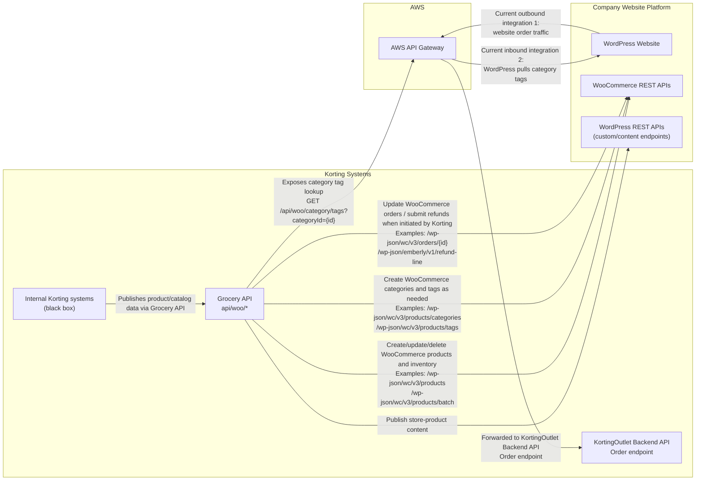

# WooCommerce / WordPress Integration Architecture

This diagram is intended as a high-level vendor handoff view of the current Korting integrations with the company website.

Scope:
- Treat all Korting internal data sourcing and business logic as a black box.
- Focus on the current integration points between Korting systems and the WordPress / WooCommerce website.

## High-Level Diagram

## Current Integration Summary

### Korting to WordPress / WooCommerce

These are the current ways Korting pushes data into the website platform:

1. Grocery product publishing into WooCommerce product APIs.
2. Grocery category creation into WooCommerce category APIs.
3. Grocery tag creation into WooCommerce tag APIs.
4. Grocery store-product publishing into WordPress custom post endpoints.
5. Order update / refund calls from Korting into WooCommerce when needed.

### Website Outbound to Korting

These are the current ways the website sends requests to Korting services:

1. Website order flow goes through AWS API Gateway and then into the KortingOutlet Backend API Order endpoint.

### Website Inbound from Korting / AWS

These are the current ways the website receives data from Korting-owned services:

1. WordPress pulls category tags through AWS API Gateway, which fronts the Grocery API endpoint `GET /api/woo/category/tags?categoryId={id}`.

## Notes for the Incoming Vendor

- Korting internal item sourcing, pricing, inventory calculations, and other downstream logic are intentionally out of scope for this diagram.
- The website should treat Korting-owned APIs as the system of integration for outbound order submission and inbound category-to-tag lookup.
- Current website-facing publishing from Korting is centered in the Grocery API and uses both WooCommerce REST APIs and WordPress REST APIs.
